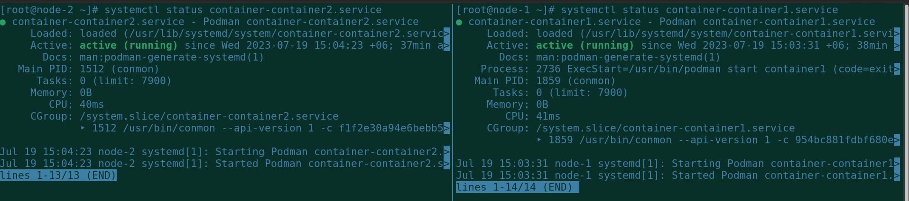

## Creating Two containers and connect them with a VXLAN 

VXLAN, which stands for Virtual Extensible LAN, is a network virtualization technology that allows for the creation of virtualized Layer 2 networks over an existing Layer 3 infrastructure. It was initially developed by VMware, Cisco, and other networking vendors to address the scalability limitations of traditional VLANs (Virtual LANs) in large-scale data center environments.

VXLAN encapsulates Layer 2 Ethernet frames within UDP (User Datagram Protocol) packets, extending the Layer 2 network over Layer 3 networks such as IP or MPLS (Multiprotocol Label Switching). By doing so, VXLAN enables the creation of virtual networks that can span across physical network boundaries, allowing for flexible and scalable deployment of virtual machines (VMs) and applications.

VXLAN provides several benefits, including:

Scalability: It allows for the creation of a large number of virtual networks, addressing the limitations of VLANs that have a limited number of available IDs.
Network Segmentation: VXLAN provides logical network segmentation, enabling isolation and multi-tenancy within a shared infrastructure.
Flexibility: Virtual networks can be easily created, modified, and moved within the data center without requiring changes to the physical network infrastructure.
Overlays: VXLAN operates as an overlay network, abstracting the physical network and providing greater flexibility for network design and provisioning.
VXLAN has gained widespread adoption in cloud computing and data center environments, where it is used to enable network virtualization, multi-tenancy, and seamless mobility of virtual workloads.


## *Prerequisites* ##

- OS: Rockylinux 9 
- Virtual Env: KVM
- Container engine: podman
- Selinux: enabled
- Firewalld: enabled


## *Diagram* ##


## Checklist

- Create two virtual machines on workstation by using KVM.
- Set the hostname.
- Install podman as container engine on both VM.
- Create a vxlan, lights up and set the IP address.
- Create container.
- Install necessary packages and modify the permission of ping response.
- Create and lights up a tunnel with vxlan id, with another VM.
- Install the bridge utils on host machine.
- Merge the tunnel with created bridge.
- Allow vxlan port on firewalld service.
- Run this container as a service.
- Check the IP reachability.


## *Create two virtual machines on workstation by using KVM* ##


I have provisioned RockyLinux-9 as a virtual machine.

```
[root@node-1 ~]# cat /etc/os-release | grep ID
    ID="rocky"
    ID_LIKE="rhel centos fedora"
    VERSION_ID="9.2"
    PLATFORM_ID="platform:el9"
```

## *Set the hostname* ##

```
hostnamectl set-hostname node-1

```

## *Install podman as container engine on VM-1.* ##

```
dnf install epel-release -y
dnf install podman* -y
```

## *Create a vxlan, lights up and set the IP address* ##

```
podman network create --subnet 172.180.190.0/29 vxlan-net
```

## *Create a container with static IP* ##

```
podman run -dit --net vxlan-net --ip 172.180.190.4 --name container1 ubuntu sleep 300000
```

## *Install necessary packages and modify the permission of ping response* ##

```
podman exec -it container1 bash
    apt update
    apt install net-tools
    apt install iputils-ping -y
    setcap cap_net_raw+p /usr/bin/ping
```

## *Create and lights up a tunnel with vxlan id, with another VM* ##

```
ip link add vxlan-podman type vxlan id 121 remote 70.80.90.141 dstport 4789 dev enp1s0
ip link set vxlan-podman up
```

## *Install the bridge utils on host machine.* ##

```
dnf install bridge-utils -y
```


## *Merge the tunnel with created bridge.* ##

```
brctl addif podman1 vxlan-podman
```


## *Allow vxlan port on firewalld service.* ##

```
firewall-cmd --per --add-port=4789/udp
firewall-cmd --reload

```

## *Run this container as a service* ##

```
cd /usr/lib/systemd/system/
podman generate systemd container1 -f -n
systemctl daemon-reload
systemctl enable container-container1.service --now
```


## *Create two virtual machines on workstation by using KVM* ##


I have provisioned RockyLinux-9 as a virtual machine.

```
[root@node-2 ~]# cat /etc/os-release | grep ID
    ID="rocky"
    ID_LIKE="rhel centos fedora"
    VERSION_ID="9.2"
    PLATFORM_ID="platform:el9"
```

## *Set the hostname* ##

```
hostnamectl set-hostname node-2

```

## *Install podman as container engine on VM-1.* ##

```
dnf install epel-release -y
dnf install podman* -y
```

## *Create a vxlan, lights up and set the IP address* ##

```
podman network create --subnet 172.180.190.0/29 vxlan-net
```

## *Create a container with static IP* ##

```
podman run -dit --net vxlan-net --ip 172.180.190.5 --name container2 ubuntu sleep 300000
```

## *Install necessary packages and modify the permission of ping response* ##

```
podman exec -it container1 bash
    apt update
    apt install net-tools
    apt install iputils-ping -y
    setcap cap_net_raw+p /usr/bin/ping
```

## *Create and lights up a tunnel with vxlan id, with another VM* ##

```
ip link add vxlan-podman type vxlan id 121 remote 70.80.90.251 dstport 4789 dev enp1s0
ip link set vxlan-podman up
```

## *Install the bridge utils on host machine.* ##

```
dnf install bridge-utils -y
```


## *Merge the tunnel with created bridge.* ##

```
brctl addif podman1 vxlan-podman
```


## *Allow vxlan port on firewalld service.* ##

```
firewall-cmd --per --add-port=4789/udp
firewall-cmd --reload

```

## *Run this container as a service* ##

```
cd /usr/lib/systemd/system/
podman generate systemd container2 -f -n
systemctl daemon-reload
systemctl enable container-container2.service --now
```


## *Relevent logs* ##

Check the host IP address


Check the containers


Check the IP addresses on both containers


Check the bridge interfaces


Ping response check from containers


Show all interfaces


Firewalld status


Container as service

