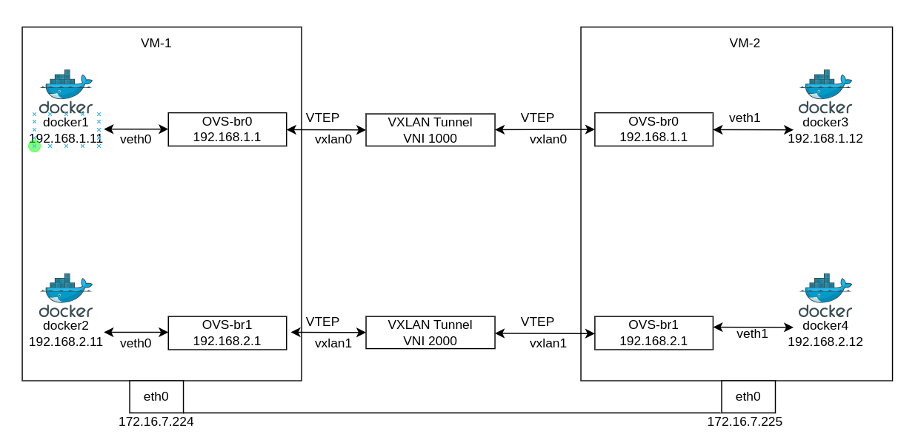
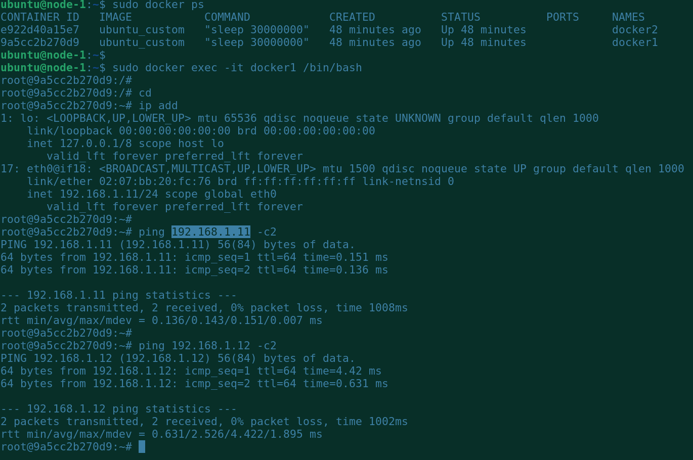
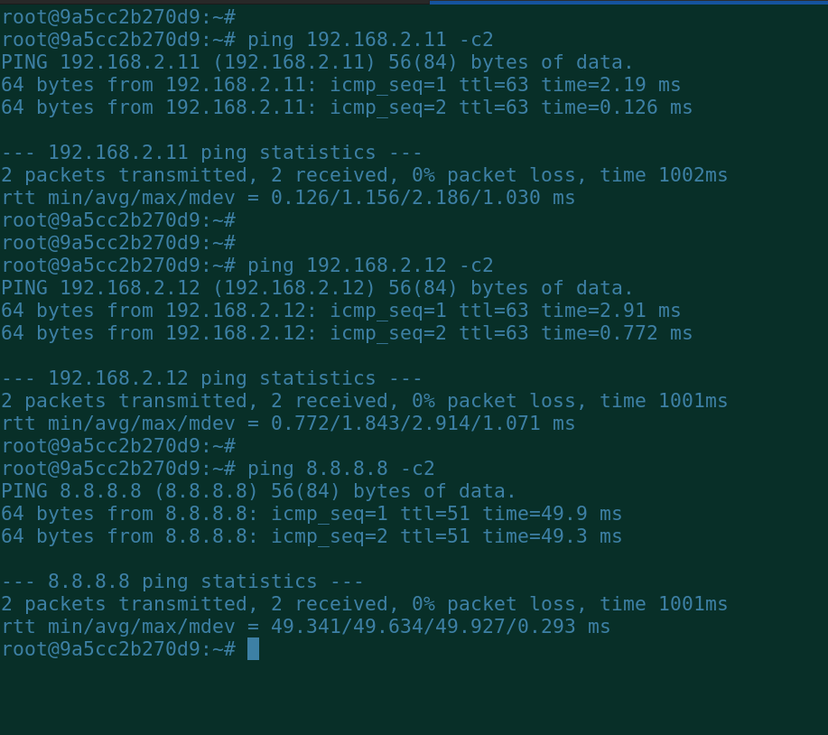

## Creating Two containers and connect them with OpenVSwitch


Open vSwitch (OpenvSwitch or OVS) is an open-source, multilayer virtual switch designed to be used in virtualized environments like data centers, cloud computing, and network virtualization. It enables network virtualization by providing the functionality of a traditional network switch while offering additional features that make it suitable for modern virtualization scenarios.

Key features of Open vSwitch include:

Multi-layer Switching: Open vSwitch operates at multiple OSI (Open Systems Interconnection) layers, including layer 2 (data link layer) and layer 3 (network layer), allowing it to handle various types of network traffic and perform routing tasks.

Network Overlay Support: Open vSwitch supports network overlay technologies like VXLAN, GRE, and Geneve, which allow virtual networks to be extended across physical network boundaries, facilitating scalable and flexible network virtualization.

SDN (Software-Defined Networking) Integration: Open vSwitch is designed to work seamlessly with SDN controllers, enabling centralized management and control of network configurations and policies.

Flow-based Forwarding: It implements flow-based forwarding, where packets are matched to specific flows and forwarded accordingly, providing efficient packet processing.

QoS (Quality of Service): Open vSwitch allows you to set up Quality of Service policies to prioritize certain types of traffic and ensure better performance for critical applications.

Monitoring and Debugging: Open vSwitch provides tools and features for monitoring and debugging network traffic, allowing administrators to gain insights into the virtualized network environment.

OpenFlow Support: OpenFlow is a protocol that enables communication between the SDN controller and the switches. Open vSwitch has support for OpenFlow, allowing it to integrate into SDN environments effectively.

Open vSwitch is widely used in various virtualization platforms, including OpenStack, KVM (Kernel-based Virtual Machine), and Docker, to facilitate network connectivity and management within virtualized environments.


## *Prerequisites* ##

- OS: Ubuntu 20.04
- Virtual Env: KVM
- Container engine: docker


## *Diagram* ##



## Checklist

- Create two virtual machines on workstation by using KVM.
- Set the hostname.
- Install dependent packages and bridge utils on host machine.
- Install docker as container engine on both VM.
- Create two bridges by using OVS and lights up.
- Add the veths with OVS.
- Set the IP addresses on VETHs.
- Set the MTU on VETHs.
- Create a custom containerfile.
- Create containers from the containerfile.
- Add IP addresses on the containers by using ovs-docker.
- Create and lights up a tunnel with vxlan id, with another VM by using ovs.
- Configure the NAT rules for veth0
- Configure the NAT rules for veth1
- Check the IP reachability.


## *Create a virtual machines on workstation by using KVM* ##


I have provisioned Ubuntu-20 as a virtual machine.

```
[root@node-1 ~]# cat /etc/os-release | grep ID
    ID="rocky"
    ID_LIKE="rhel centos fedora"
    VERSION_ID="9.2"
    PLATFORM_ID="platform:el9"
```

## *Set the hostname* ##

```
sudo hostnamectl set-hostname node-1

```

## *Install dependent packages* ##

```
sudo apt update
sudo apt -y install net-tools openvswitch-switch
```

## *Install podman as container engine on both VM* ##

```
sudo apt install docker.io -y
```

## *Create two bridges by using OVS and lights up.* ##

```
sudo ovs-vsctl add-br ovs-br0
sudo ovs-vsctl add-br ovs-br1
```

## *Add the veths with OVS* ##

```
sudo ovs-vsctl add-port ovs-br0 veth0 -- set interface veth0 type=internal
sudo ovs-vsctl add-port ovs-br1 veth1 -- set interface veth1 type=internal
```

## *Set the IP addresses on VETHs* ##

```
sudo ip address add 192.168.1.1/24 dev veth0 
sudo ip address add 192.168.2.1/24 dev veth1
```

## *Set the MTU on VETHs* ##

```
sudo ip link set dev veth0 up mtu 1450
sudo ip link set dev veth1 up mtu 1450
```

## *Create a custom dpckerfile* ##
```
vim DockerFile
    FROM ubuntu
    RUN apt update
    RUN apt install -y net-tools
    RUN apt install -y iproute2
    RUN apt install -y iputils-ping

    CMD ["sleep", "30000000"]
```

## *Create an image from the containerfile* ##

```
sudo docker build . -f DockerFile -t ubuntu_custom
```

## *Create containers* ##

```
sudo docker run -dit --net none --name docker1 ubuntu_custom
sudo docker run -dit --net none --name docker2 ubuntu_custom
```

## *Add IP addresses on the containers by using ovs-docker* ##

```
sudo ovs-docker add-port ovs-br0 eth0 docker1 --ipaddress=192.168.1.11/24 --gateway=192.168.1.1
sudo ovs-docker add-port ovs-br1 eth0 docker2 --ipaddress=192.168.2.11/24 --gateway=192.168.2.1
```


## *Create and lights up a tunnel with vxlan id, with another VM by using ovs* ##

```
sudo ovs-vsctl add-port ovs-br0 vxlan0 -- set interface vxlan0 type=vxlan options:remote_ip=172.16.7.225 options:key=1000
sudo ovs-vsctl add-port ovs-br1 vxlan1 -- set interface vxlan1 type=vxlan options:remote_ip=172.16.7.225 options:key=2000
```

## *Configure the NAT rules for veth0* ##

```
sudo iptables --append FORWARD --in-interface veth0 --jump ACCEPT
sudo iptables --append FORWARD --out-interface veth0 --jump ACCEPT
sudo iptables --table nat --append POSTROUTING --source 192.168.1.0/24 --jump MASQUERADE
```

## *Configure the NAT rules for veth1* ##

```
sudo iptables --append FORWARD --in-interface veth1 --jump ACCEPT
sudo iptables --append FORWARD --out-interface veth1 --jump ACCEPT
sudo iptables --table nat --append POSTROUTING --source 192.168.2.0/24 --jump MASQUERADE
```

## *Check the IPTABLES rules* ##

```
sudo iptables -t nat -L -n -v
```


## *Create a virtual machines on workstation by using KVM* ##


I have provisioned Ubuntu-20 as a virtual machine.

```
[root@node-1 ~]# cat /etc/os-release | grep ID
    ID="rocky"
    ID_LIKE="rhel centos fedora"
    VERSION_ID="9.2"
    PLATFORM_ID="platform:el9"
```

## *Set the hostname* ##

```
sudo hostnamectl set-hostname node-2

```

## *Install dependent packages* ##

```
sudo apt update
sudo apt -y install net-tools openvswitch-switch
```

## *Install podman as container engine on both VM* ##

```
sudo apt install docker.io -y
```

## *Create two bridges by using OVS and lights up.* ##

```
sudo ovs-vsctl add-br ovs-br0
sudo ovs-vsctl add-br ovs-br1
```

## *Add the veths with OVS* ##

```
sudo ovs-vsctl add-port ovs-br0 veth0 -- set interface veth0 type=internal
sudo ovs-vsctl add-port ovs-br1 veth1 -- set interface veth1 type=internal
```

## *Set the IP addresses on VETHs* ##

```
sudo ip address add 192.168.1.1/24 dev veth0 
sudo ip address add 192.168.2.1/24 dev veth1
```

## *Set the MTU on VETHs* ##

```
sudo ip link set dev veth0 up mtu 1450
sudo ip link set dev veth1 up mtu 1450
```

## *Create a custom dpckerfile* ##
```
vim DockerFile
    FROM ubuntu
    RUN apt update
    RUN apt install -y net-tools
    RUN apt install -y iproute2
    RUN apt install -y iputils-ping

    CMD ["sleep", "30000000"]
```

## *Create an image from the containerfile* ##

```
sudo docker build . -f DockerFile -t ubuntu_custom
```

## *Create containers* ##

```
sudo docker run -dit --net none --name docker3 ubuntu_custom
sudo docker run -dit --net none --name docker4 ubuntu_custom
```

## *Add IP addresses on the containers by using ovs-docker* ##

```
sudo ovs-docker add-port ovs-br0 eth0 docker3 --ipaddress=192.168.1.12/24 --gateway=192.168.1.1
sudo ovs-docker add-port ovs-br1 eth0 docker4 --ipaddress=192.168.2.12/24 --gateway=192.168.2.1
```


## *Create and lights up a tunnel with vxlan id, with another VM by using ovs* ##

```
sudo ovs-vsctl add-port ovs-br0 vxlan0 -- set interface vxlan0 type=vxlan options:remote_ip=172.16.7.224 options:key=1000
sudo ovs-vsctl add-port ovs-br1 vxlan1 -- set interface vxlan1 type=vxlan options:remote_ip=172.16.7.224 options:key=2000
```


## *Configure the NAT rules for veth0* ##

```
sudo iptables --append FORWARD --in-interface veth0 --jump ACCEPT
sudo iptables --append FORWARD --out-interface veth0 --jump ACCEPT
sudo iptables --table nat --append POSTROUTING --source 192.168.1.0/24 --jump MASQUERADE
```

## *Configure the NAT rules for veth1* ##

```
sudo iptables --append FORWARD --in-interface veth1 --jump ACCEPT
sudo iptables --append FORWARD --out-interface veth1 --jump ACCEPT
sudo iptables --table nat --append POSTROUTING --source 192.168.2.0/24 --jump MASQUERADE
```

## *Check the IPTABLES rules* ##

```
sudo iptables -t nat -L -n -v
```


## *Logs for the IP reachability* ##


