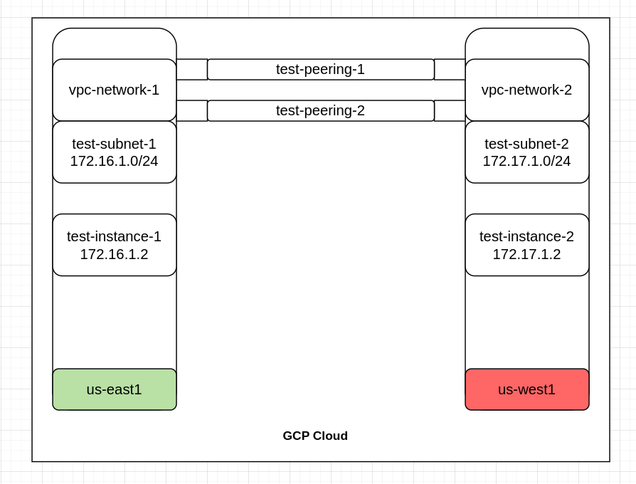

Google Cloud Platform (GCP) offers the capability to peer virtual networks (VPCs) across different regions using a feature called "Global VPC Peering." This allows you to connect VPCs in different regions within the same project or across different projects. Here's how it works:

**Global VPC Peering:** Global VPC Peering allows you to create VPC peering connections between VPCs in different regions. This means you can connect VPCs across regions, and traffic between the peered VPCs will be routed over Google's global network infrastructure.

## _Prerequisites_ ##

- OS: Rockylinux 9
- Virtual Env: GCP
- Firewalld: enabled
- Allow port: 80/tcp, 443/tcp, 22/tcp
- Allow IP: 35.235.240.0/20

## *Diagram* ##

## Checklist ##
- Create two VPC networks in different region with different prefix.
- Create two instances in different region with created VPC networks.
- Modify the firewall rules.
- Install the required packages in both instances.
- Create VPC network peering on both instances.
- Check the connectivity from both instances by telnet and ping.

## Create 1st VPC network ##
- Search "VPC networks" in search box
- Click "Create a VPC network"
    - name: vpc-network-1
- Create new subnet
    - name: test-subnet-1
    - Region: us-east1
    - IP stack type:
        - ipv4 (single stack)
    - ipv4 range: 172.16.1.0/24
- Private Google Access:
    - On
- Dynamic routing mode
    - Regional

## Create 2nd VPC network ##
- Search "VPC networks" in search box
- Click "Create a VPC network"
    - name: vpc-network-2
- Create new subnet
    - name: test-subnet-2
    - Region: us-west1
    - IP stack type:
        - ipv4 (single stack)
    - ipv4 range: 172.17.1.0/24
- Private Google Access:
    - On
- Dynamic routing mode
    - Regional

## Create 1st instance ##
- Search "Compute Engine" in search box
- Click "Create Instance"
- Name
    - test-instance-1
- Region
    - us-east1
- Zone
    - us-east1-c
- Machine configuration
    - E2
- Boot disk
    - Public Images:
        - OS: Rocky Linux
        - Version: Rocky Linux 9 optimized for GCP
- Advance Options:
    - Networking:
        - Network Interfaces:
            - Network: vpc-network-1
        - Primary Internal ipv4 address:
            - Ephemeral (automatic)

## Create 2nd instance ##
- Search "Compute Engine" in search box
- Click "Create Instance"
- Name
    - test-instance-2
- Region
    - us-west1
- Zone
    - us-west1-c
- Machine configuration
    - E2
- Boot disk
    - Public Images:
        - OS: Rocky Linux
        - Version: Rocky Linux 9 optimized for GCP
- Advance Options:
    - Networking:
        - Network Interfaces:
            - Network: vpc-network-2
        - Primary Internal ipv4 address:
            - Ephemeral (automatic)

## Update the Firewall rules for 1st VPC network ##

- Search "Firewall" in search box
- Click "Create Firewall rule"
    - Name: allow-ssh-1
    - Network: vpc-network-1
    - Priority: 1000
    - Action on match: Allow
    - Target: All instances in the network
    - Source filter: ipv4
    - Source ipv4 range: 35.235.240.0/20
    - Protocols and ports:
        - Specified protocols and ports
            - TCP
            - 22
- Click "Create Firewall rule"
    - Name: allow-http-1
    - Network: vpc-network-1
    - Priority: 1000
    - Action on match: Allow
    - Target: All instances in the network
    - Source filter: ipv4
    - Source ipv4 range: 0.0.0.0/0
    - Protocols and ports:
        - Specified protocols and ports
            - TCP
            - 80, 443
- Click "Create Firewall rule"
    - Name: allow-ping-1
    - Network: vpc-network-1
    - Priority: 1000
    - Action on match: Allow
    - Target: All instances in the network
    - Source filter: ipv4
    - Source ipv4 range: 0.0.0.0/0
    - Protocols and ports:
        - Specified other protocols
            - icmp

## Update the Firewall rules for 2nd VPC network ##

- Search "Firewall" in search box
- Click "Create Firewall rule"
    - Name: allow-ssh-2
    - Network: vpc-network-2
    - Priority: 1000
    - Action on match: Allow
    - Target: All instances in the network
    - Source filter: ipv4
    - Source ipv4 range: 35.235.240.0/20
    - Protocols and ports:
        - Specified protocols and ports
            - TCP
            - 22
- Click "Create Firewall rule"
    - Name: allow-http-2
    - Network: vpc-network-2
    - Priority: 1000
    - Action on match: Allow
    - Target: All instances in the network
    - Source filter: ipv4
    - Source ipv4 range: 0.0.0.0/0
    - Protocols and ports:
        - Specified protocols and ports
            - TCP
            - 80, 443
- Click "Create Firewall rule"
    - Name: allow-ping-2
    - Network: vpc-network-2
    - Priority: 1000
    - Action on match: Allow
    - Target: All instances in the network
    - Source filter: ipv4
    - Source ipv4 range: 0.0.0.0/0
    - Protocols and ports:
        - Specified other protocols
            - icmp

## Create 1st VPC network peering ##
- Search "VPC network peering" in search box
- Click "Create Connection"
    - continue
        - Name: test-peering-1
        - Your VPC network: vpc-network-1
        - Peered VPC Network: In this project
        - VPC Network Name: vpc-network-2

## Create 2nd VPC network peering ##
- Search "VPC network peering" in search box
- Click "Create Connection"
    - continue
        - Name: test-peering-2
        - Your VPC network: vpc-network-2
        - Peered VPC Network: In this project
        - VPC Network Name: vpc-network-1

## Install required packages on both instances ##
- Search "vm instances dashboard" 
    - Login both instances by using SSH
        - sudo su
        - dnf update -y
        - dnf install nginx telnet -y
        - systemctl enable nginx --now
        - Allow services in OS firewalld
            - firewall-cmd --per --add-service=http
            - firewall-cmd --per --add-port=443/tcp
            - firewall-cmd --reload
            - firewall-cmd --list-all
        - To check all exposed port on the instances
            - ss -tulpn 

## Check the connectivity by using ping on both instances ##

## Check the connectivity by using telnet on both instances ##

